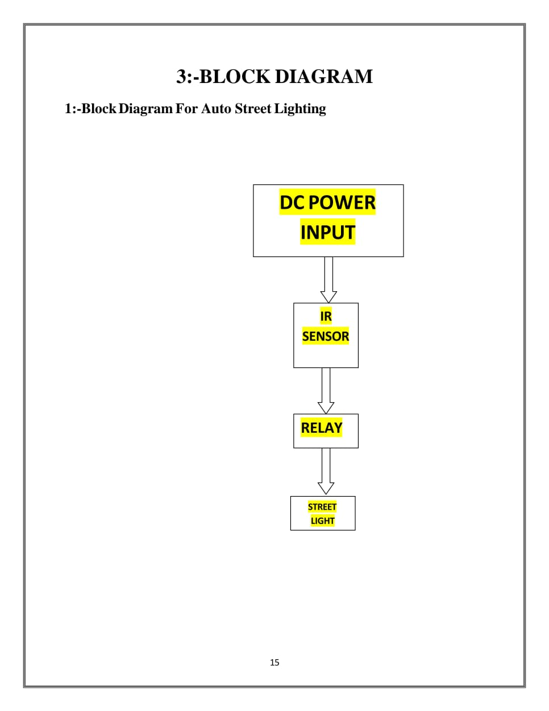
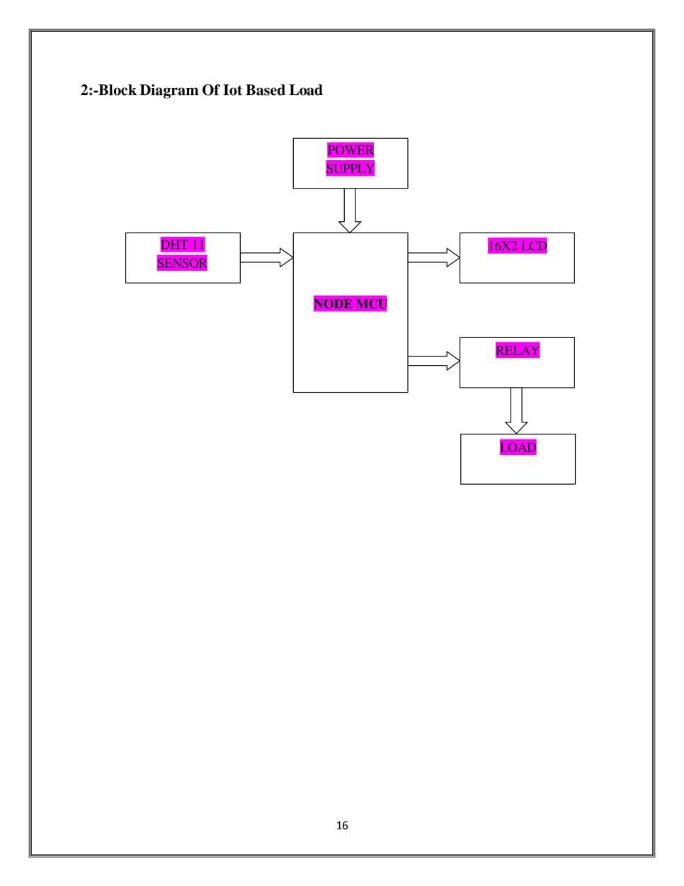
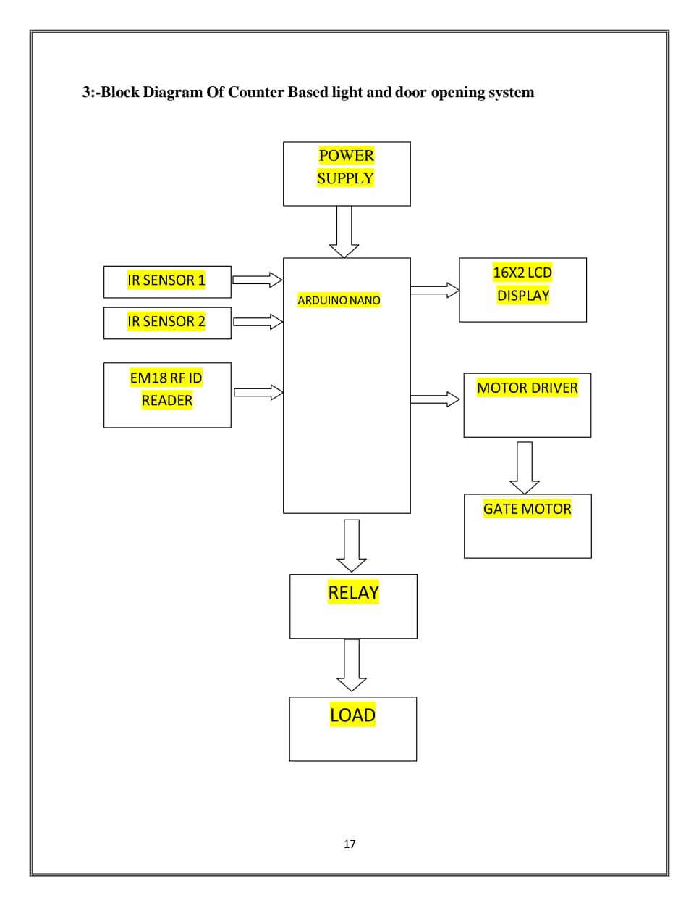
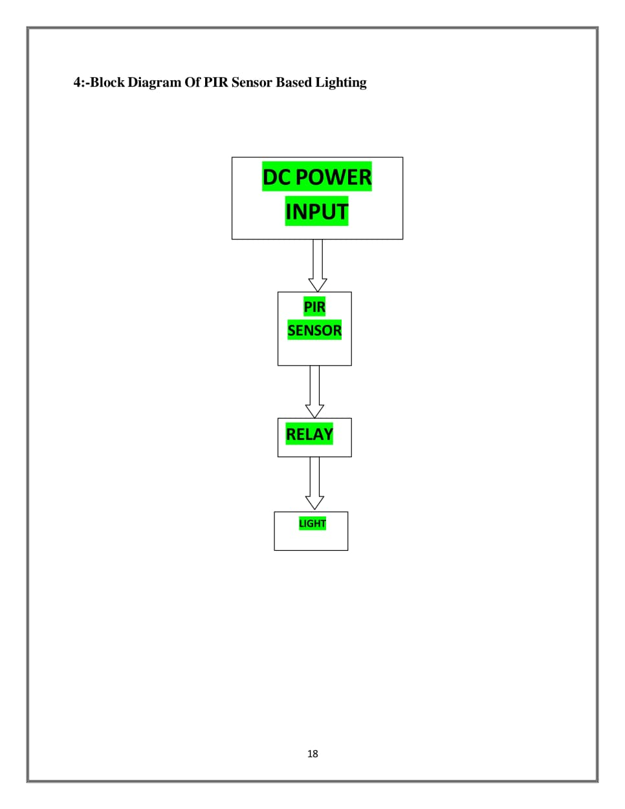

# 🏠 Home Automation Major Project  

This project proposes an efficient implementation of **IoT (Internet of Things)** for monitoring and controlling home appliances via the **World Wide Web**. The system enables remote access to lights, fans, and door locks through a smartphone-based **web interface**, with communication facilitated by **Wi-Fi** and **Raspberry Pi** as the server system.  

---

## 🔑 Highlights of the Project  
- ✅ Touch switch–based lighting  
- ✅ Mobile-operated lighting system  
- ✅ Visitor counter–based lighting system  
- ✅ Automated street lighting system  
- ✅ LPG leakage detection system  
- ✅ Fire alert system  
- ✅ IoT-based data monitoring system  

---

## 🏗 IoT Architecture  

### 1. Auto Street Lighting  

### 2. IoT-Based Load Control  
)  

### 3. Counter-Based Light & Door Opening System 
()

### 4. Door Opening System
()

---

## 🛠 Software Used  
- **Proteus** → Circuit design  
- **Circuit Wizard** → PCB layout design  
- **Arduino IDE** → Programming  

---

## ⚡ Hardware Components  
- Electrical resistance  
- Capacitor  
- P-N junction diode  
- Voltage regulator IC  
- LED  
- Transistor  
- Relay  
- NodeMCU ESP8266  

---

## 📸 Demo & Working  
()
()

---

## 🚀 Future Scope  
- Integration with voice assistants (Alexa, Google Assistant)  
- Real-time energy consumption monitoring  
- AI-based anomaly detection for home safety  

---

## 👨‍💻 Authors  
**Team Project** – Led by *[Vishal Singh]*, managed backend logic, database operations, and documentation.  
**Team Members** - Vishal Singh , Lakshya Singh, Shiva Gupta , Dev Lodhi.
